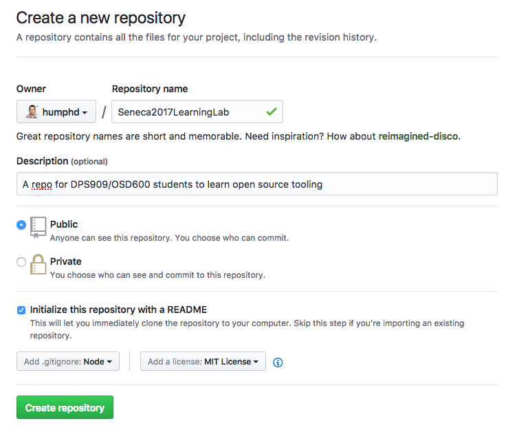

# Seneca 2017 Learning Lab

## Introduction

In this lab series we will explore a number of open source and GitHub tooling,
automation, and worflow options.  You will learn about how to build node.js modules,
how to use tools like linters, code formatters, how to use unit tests, how to do automated
checks on your commits and pull requests, etc.

We will expand on this repo in the coming weeks, so it's important for you to finish
each week's tasks before the next lab.  If you get stuck, feel free to help one another.
This is not a test, but a learning exercise.

## Create a Repo

This repo will form the basis of our exploration of various open source tooling.
Begin by creating a repo of your own similar to this one. Use https://github.com/new
to create your new repo.  Make sure you include the following:

* Initialize with a `README.me` file
* Add a `.gitignore` for `Node` (e.g., node.js)
* Add a `License` using the [MIT License](https://opensource.org/licenses/MIT)

It will look something like this:



## Clone your repo

After you've created it on GitHub, you need to clone it locally:

```bash
$ git clone git@github.com:<github-username>/<repo-name>.git
```

## Initialize a new Node.js Module

You should already have [node.js](https://nodejs.org/) installed.  If you don't,
do it now.

Next use [npm](https://docs.npmjs.com/) (NOTE: `npm` gets installed along with node.js)
to initialize your `package.json` file:

```bash
$ npm init

This utility will walk you through creating a package.json file.
It only covers the most common items, and tries to guess sensible defaults.

See `npm help json` for definitive documentation on these fields
and exactly what they do.

Use `npm install <pkg> --save` afterwards to install a package and
save it as a dependency in the package.json file.

Press ^C at any time to quit.
name: (Seneca2017LearningLab) lab7
version: (1.0.0) 1.0.0
description: Learning Lab
entry point: (index.js) seneca.js
test command:
git repository: (https://github.com/humphd/Seneca2017LearningLab.git)
keywords:
author:
license: (ISC) MIT
About to write to /Users/dave/Sites/repos/Seneca2017LearningLab/package.json:

{
  "name": "lab7",
  "version": "1.0.0",
  "description": "Learning Lab",
  "main": "seneca.js",
  "scripts": {
    "test": "echo \"Error: no test specified\" && exit 1"
  },
  "repository": {
    "type": "git",
    "url": "git+https://github.com/humphd/Seneca2017LearningLab.git"
  },
  "author": "",
  "license": "MIT",
  "bugs": {
    "url": "https://github.com/humphd/Seneca2017LearningLab/issues"
  },
  "homepage": "https://github.com/humphd/Seneca2017LearningLab#readme"
}


Is this ok? (yes)
```

Confirm that your `package.json` is correct, and edit it if not:

```bash
$ cat package.json
{
  "name": "lab7",
  "version": "1.0.0",
  "description": "Learning Lab",
  "main": "seneca.js",
  "scripts": {
    "test": "echo \"Error: no test specified\" && exit 1"
  },
  "repository": {
    "type": "git",
    "url": "git+https://github.com/humphd/Seneca2017LearningLab.git"
  },
  "author": "",
  "license": "MIT",
  "bugs": {
    "url": "https://github.com/humphd/Seneca2017LearningLab/issues"
  },
  "homepage": "https://github.com/humphd/Seneca2017LearningLab#readme"
}
```

## Create your Node.js Module in seneca.js

You need a file to contain your `seneca` module.  Create a file named `seneca.js`,
which should have the following code:

```js
// [INFO] See discussion of node.js exports here:
// https://www.sitepoint.com/understanding-module-exports-exports-node-js/

/**
 * Given a string `email`, return `true` if the string is in the form
 * of a valid Seneca College email address, `false` othewise.
 */
exports.isValidEmail = function(email) {
    // TODO: needs to be implemented
};

/**
 * Given a string `name`, return a formatted Seneca email address for
 * this person. NOTE: the email doesn't need to be real/valid/active.
 */
exports.formatSenecaEmail = function(name) {
    // TODO: needs to be implemented
};
```

Write an implementation of `isValidEmail` and `formatSenecaEmail`.  You are
only expected to validate and work with strings, you don't need to deal with
sending or validating email addresses in general.

## Add ESLint to avoid common patterns and bugs

Linting your code is a great way to avoid various common problems.  We'll use
[ESLint](http://eslint.org/docs/user-guide/getting-started) to find common issues
and then manually correct them.

Begin by installing it via `npm`.  We'll use `--save-dev` to add a development dependency
(i.e., a dependency only needed when developing this code vs. using it).  We'll also create
a default `eslint` configuration (i.e., rules to check for in our code):

```bash
$ npm install eslint --save-dev
```

The `eslint` module is similar to what we're building.  It will automatically get installed
to a directory named `node_modules`.  A `node_modules/.bin` hidden directory is also created
with a so-called "binary" or executable version of eslint that can be run at the command-line:

```bash
$ ls -a node_modules
.      ..     .bin   eslint
```

We need to create a configuration for `eslint`.  Let's try using a "popular style guide",
the [Airbnb JavaScript rules](https://github.com/airbnb/javascript).  Run `eslint --init`
and then cursor down to `Use a popular style guide`:

```bash
$ ./node_modules/.bin/eslint --init
? How would you like to configure ESLint?
  Answer questions about your style
❯ Use a popular style guide
  Inspect your JavaScript file(s)
```

Cursor down to select `Airbnb`:

```bash
? Which style guide do you want to follow?
  Google
❯ Airbnb
  Standard
```

When asked about React, answer No:

```bash
? Do you use React? (y/N) N
```

Select JSON format for your eslint config file:

```bash
? What format do you want your config file to be in?
  JavaScript
  YAML
❯ JSON
```

Various `npm` modules will now be installed:

```bash
Installing eslint-plugin-import, eslint-config-airbnb-base
eslint-config-airbnb-base@11.1.1 node_modules/eslint-config-airbnb-base

eslint-plugin-import@2.2.0 node_modules/eslint-plugin-import
├── contains-path@0.1.0
├── lodash.cond@4.5.2
├── builtin-modules@1.1.1
├── doctrine@1.5.0 (isarray@1.0.0, esutils@2.0.2)
├── has@1.0.1 (function-bind@1.1.0)
├── debug@2.6.3 (ms@0.7.2)
├── minimatch@3.0.3 (brace-expansion@1.1.6)
├── pkg-up@1.0.0 (find-up@1.1.2)
├── eslint-module-utils@2.0.0 (debug@2.2.0, pkg-dir@1.0.0)
└── eslint-import-resolver-node@0.2.3 (object-assign@4.1.1, resolve@1.3.2)
Successfully created .eslintrc.json file in /Users/dave/Sites/repos/Seneca2017LearningLab
```

You now have a new file `.eslintrc.json` which has the rules you want `eslint` to follow:

```json
{
    "extends": "airbnb-base",
    "plugins": [
        "import"
    ]
}
```

Your `package.json` will also have new `devDependency` entries:

```json
"devDependencies": {
  "eslint": "^3.17.1",
  "eslint-config-airbnb-base": "^11.1.1",
  "eslint-plugin-import": "^2.2.0"
}
```

Try running `eslint` on your code:

```bash
$ ./node_modules/.bin/eslint seneca.js

/Users/dave/Sites/repos/Seneca2017LearningLab/seneca.js
   5:24  warning  Unexpected unnamed function                func-names
   5:32  error    Missing space before function parentheses  space-before-function-paren
   5:33  error    'email' is defined but never used          no-unused-vars
  13:29  warning  Unexpected unnamed function                func-names
  13:37  error    Missing space before function parentheses  space-before-function-paren
  13:38  error    'name' is defined but never used           no-unused-vars

✖ 6 problems (4 errors, 2 warnings)
```

You can read about the various rules and warnings in the `eslint docs`, for example:
http://eslint.org/docs/rules/space-before-function-paren or http://eslint.org/docs/rules/no-unused-vars

## Automate our Lint Checking

Since we'll want to check our code every time we make changes, it's nice to automate the
call to `eslint` and make a script that we can run.  We can add scripts to our `package.json`
file, which are then runnable via `npm`.

Modify the `scripts` section of your `package.json` to add a `lint` task, and update the
`test` task to run this task, passing `-s` for silent mode (keep `npm` from spitting out
debug info):

```json
"scripts": {
  "lint": "node_modules/.bin/eslint *.js",
  "test": "npm run -s lint"
}
```

NOTE: the extra `; exit 0` is add to deal with the case of their being no errors
and wanting the return code to be `0` vs. npm logs, see https://github.com/eslint/eslint/issues/2409

## Use TravisCI for Continuous Integration

Now that we have the basics of our code infrastructure set up, we can use
a free continuous integration service named [Travis CI](https://travis-ci.org/) to help us run these
checks every time we do a new commit or someone creates a pull request.

Follow the [Getting started](https://docs.travis-ci.com/user/getting-started/) guide and the
[Building a Node.js project](https://docs.travis-ci.com/user/languages/javascript-with-nodejs/) docs
to do the following:

* [Sign in to Travis CI](https://docs.travis-ci.com/user/getting-started/) with your GitHub account
* Enable Travis CI integration with your GitHub account for this repo in your [profile page](https://travis-ci.org/profile)
* Create a `.travis.yml` file for a [`node` project](https://docs.travis-ci.com/user/languages/javascript-with-nodejs/).  It will automatically run your `npm test` command.  You can specify `"node"` as your node.js version to use the latest stable version of node.
* Push a new commit to your repo's `master` branch to start a build on Travis. You can check
your builds at https://travis-ci/profile/<git-username>/<repo-name>.  For example, here is my repo's
Travis build page: https://travis-ci.org/humphd/Seneca2017LearningLab

Get your build to pass by fixing any errors or warnings that you have.

## Add a Travis CI Build Badge to your README

You can have Travis CI automatically indicate whether your current code is passing or failing
by adding a badge to your `README.md` file.  Instructions on how to do it are here:

https://docs.travis-ci.com/user/status-images/

Here is the badge for my repo's Travis Build:

[](https://travis-ci.org/humphd/Seneca2017LearningLab)

My build is failing because I have not fixed the eslint errors and warnings for my code.
